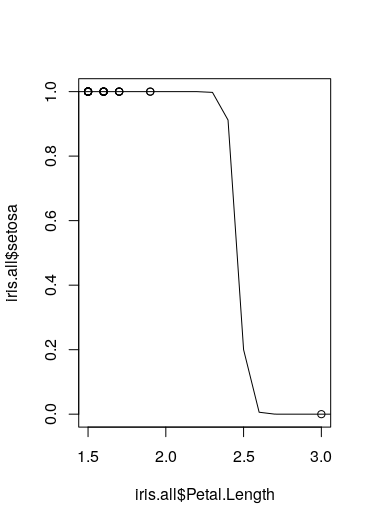

# 統計分析勉強リポジトリ

## R

### 環境構築

[ここのページ](https://datasciencemore.com/docker/)を参考に R の環境構築を実施した。

### ショートカット

[ショートカットキー一覧ページ](http://kohske.github.io/R/rstudio/cheetsheet/RStudio-Rmdv2-cheat.pdf)

### 代入演算子

`<-`と`=`の違いだが、[どちらを使用してもとくに問題はないが、時にはエラーとなることもある](https://www.lovezawa.com/entry/2015/01/21/R%E3%81%AE%3C%3C-%E3%81%A8%3C-%E3%81%A8%3D%E3%81%AE%E9%81%95%E3%81%84)。ベクトルの定義では、`<-`がよく使用されている。これは、「Alt + -」でショートカットできる。

### パイプ

[ある数式の出力を別の数式の入力として値を渡すためのもの](https://qiita.com/Quantas/items/1a2107341b1476ce6044)。bash のパイプと同じ使い方をする。

```R
> test_vec<-c(12,3,1,21,23,44)
> test_vec%>%head(2)
[1] 12  3
> test_vec%>%mean()
[1] 17.33333
> test_vec %>% head(3) %>% mean()
[1] 5.333333
```

<<<<<<< HEAD
- ショートカット : 「ctr」+「shift」+「m」
=======
#### ショートカット

- Mac
  - Ctr + Shift + M

### ファイルの読み込み

- to_one_or_zero.R
```R
to_one_or_zero <- function(vector,factorName)
{
    vector_tmp <- as.character(vector)
    vector_tmp <- replace(vector_tmp, vector_tmp != factorName,0)
    vector_tmp <- replace(vector_tmp, vector_tmp == factorName,1)
    vector_tmp <- as.numeric(vector_tmp)
    return (vector_tmp)
}
```

Rスクリプトを記述して、作成したスクリプト内に存在する関数を使用する場合は、`source`コマンドを使用する。Rの対話モードでファイルの読み込みを行う場合は以下のようにして自作関数を使用できる。今回は、因子型のベクトルをロジスティック回帰の応答変数とするための前処理のためにスクリプトに前処理用の関数を定義した。変換対象のベクトルと水準名を入力して0と1で表現されたベクトルへ変換する処理を記載している。

```R
> source("./to_one_or_zero.R")
> x <- to_one_or_zero(iris.all$Species,"versicolor")
> x
  [1] 0 0 0 0 0 0 0 0 0 0 0 0 0 0 0 0 0 0 0 0 0 0 0 0 0
 [26] 0 0 0 0 0 0 0 0 0 0 0 0 0 0 0 0 0 0 0 0 0 0 0 0 0
 [51] 1 1 1 1 1 1 1 1 1 1 1 1 1 1 1 1 1 1 1 1 1 1 1 1 1
 [76] 1 1 1 1 1 1 1 1 1 1 1 1 1 1 1 1 1 1 1 1 1 1 1 1 1
[101] 0 0 0 0 0 0 0 0 0 0 0 0 0 0 0 0 0 0 0 0 0 0 0 0 0
[126] 0 0 0 0 0 0 0 0 0 0 0 0 0 0 0 0 0 0 0 0 0 0 0 0 0
```

### 行列の演算

[参考ページ](https://stats.biopapyrus.jp/r/basic/matrix.html)

### EDA

```R
> class(iris)
[1] "data.frame"
> head(iris,2)
  Sepal.Length Sepal.Width Petal.Length Petal.Width Species
1          5.1         3.5          1.4         0.2  setosa
2          4.9         3.0          1.4         0.2  setosa
> summary(iris)
  Sepal.Length    Sepal.Width     Petal.Length    Petal.Width          Species  
 Min.   :4.300   Min.   :2.000   Min.   :1.000   Min.   :0.100   setosa    :50  
 1st Qu.:5.100   1st Qu.:2.800   1st Qu.:1.600   1st Qu.:0.300   versicolor:50  
 Median :5.800   Median :3.000   Median :4.350   Median :1.300   virginica :50  
 Mean   :5.843   Mean   :3.057   Mean   :3.758   Mean   :1.199                  
 3rd Qu.:6.400   3rd Qu.:3.300   3rd Qu.:5.100   3rd Qu.:1.800                  
 Max.   :7.900   Max.   :4.400   Max.   :6.900   Max.   :2.500  
# データの分割
> iris_setosa <- iris %>% filter(Species=="setosa")
> iris_versicolor <- iris %>% filter(Species == "versicolor")
> iris_virginica <- iris %>% filter(Species == "virginica")
> hist(iris_setosa[["Sepal.Length"]],100)
```
>>>>>>> a8828fcd6f996ac41bae7eacf71b8fd107663220

### tidyverse ハンズオン

[shun さんの tidyverse 講座](https://datasciencemore.com/category/ds-lecture/r-preprocess-lecture/)

#### さまざまな型

[R で多様されるベクトル、factor などについて R コンソールを使用してハンズオンで確認しながら学習したので、コマンドとともに以下にまとめる](https://datasciencemore.com/datatype/)。

```R
# vectorをfactorへ変換
# orderedをTrueにすると値の大小関係が保存される
> c("spring","summer","autumn","winter")%>%factor(ordered = TRUE)
[1] spring summer autumn winter
4 Levels: autumn < ... < winter
# orderedをFalseにすると大小関係は保存されない
> c("spring","summer","autumn","winter") %>% factor(ordered = FALSE)
[1] spring summer autumn winter
4 Levels: autumn spring ... winter
# fct_relevelを使用すると入力順に水準を１～に決定する
> c("spring","summer","autumn","winter")%>%factor(ordered = TRUE)%>%fct_relevel("spring","summer","autumn","winter")
[1] spring summer autumn winter
4 Levels: spring < ... < winter

# seasonのvalueが数値として認識されていることが分かる
> df_order %>% filter(season>"summer")
# A tibble: 2 x 2
  season avg_temp
  <ord>     <dbl>
1 autumn       18
2 winter        9
```

#### Vector

[ベクトル関連](https://datasciencemore.com/vector/)

##### 基本操作

```R
# ベクトルの演算
# 要素のサイズが異なっていても、リサイクルと呼ばれる補完機能でサイズが小さい方の要素を繰り返して計算してくれる
> sum_vec=c(1,2,3,4,5)+c(4,3)
Warning message:
In c(1, 2, 3, 4, 5) + c(4, 3) :
  longer object length is not a multiple of shorter object length
> sum_vec=c(1,2,3,4,5)+c(4,3,4,3,4)
[1] 5 5 7 7 9

# 要素の抽出
> sum_vec <- c(1,2,3,4,5)
> sum_vec[c(2,3)]
[1] 2 3
> sum_vec[c(-2,-4)]
[1] 1 3 5
> sum_vec[c(TRUE,FALSE,TRUE,FALSE,FALSE)]
[1] 1 3
> sum_vec[sum_vec>3]
[1] 4 5

# 名前付きベクトル
> name_vec <- c("one"=1,"two"=2, "three"=3,"four"=4,"five"=5)
> name_vec[c("one","three")]
  one three
    1     3
```

##### ベクトルの組み込みメソッド

```R
> sum_vec %>% sum()
[1] 15
> sum_vec %>% mean()
[1] 3
> sum_vec %>% max()
[1] 5
> sum_vec %>% min()
[1] 1
> sum_vec %>% median()
[1] 3
> sum_vec %>% quantile()
  0%  25%  50%  75% 100%
   1    2    3    4    5
> sum_vec %>% var()
[1] 2.5
# 標準偏差
> sum_vec %>% sd()
[1] 1.581139
```

##### 規則的なベクトルの生成

```R
# １ずつ等差のベクトルを生成
> eq_diff_arr <- 1:10
> eq_diff_arr
 [1]  1  2  3  4  5  6  7  8  9 10

# 長さ指定の等差ベクトル
> eq_diff_arr <- seq(1.5,10.3,length = 8)
> eq_diff_arr
[1]  1.500000  2.757143  4.014286
[4]  5.271429  6.528571  7.785714
[7]  9.042857 10.300000

# 幅指定の等差ベクトル
> eq_diff_arr <- seq(1.5 ,10.3, by=2.5)
> eq_diff_arr
[1] 1.5 4.0 6.5 9.0


# 全体を単純に繰り返す
> arr_rep <- rep(c("red","blue","green"),times=3)
> arr_rep
[1] "red"   "blue"  "green" "red"
[5] "blue"  "green" "red"   "blue"
[9] "green"

# 指定の長さまで繰り返す
> arr_rep <- rep(c("red","blue","green"),length=5)
> arr_rep
[1] "red"   "blue"  "green" "red"
[5] "blue"

# 要素毎に繰り返す
> arr_rep <- rep(c("red","blue","green"),each=3)
> arr_rep
[1] "red"   "red"   "red"   "blue"
[5] "blue"  "blue"  "green" "green"
[9] "green"
```

#### 論理値ベクトル

```R
# difined vectors
> x <- 1:10
> y <- c(1,3,4,7,2)

> x == y
 [1]  TRUE FALSE FALSE FALSE FALSE FALSE
 [7] FALSE FALSE FALSE FALSE

# xの各要素がyに含まれているか
> x %in% y
 [1]  TRUE  TRUE  TRUE  TRUE FALSE FALSE
 [7]  TRUE FALSE FALSE FALSE
> y %in% x
[1] TRUE TRUE TRUE TRUE TRUE

# xの各要素がyよりも小さいか
> x < y
 [1] FALSE  TRUE  TRUE  TRUE FALSE FALSE
 [7] FALSE FALSE FALSE FALSE
```

#### リスト・データフレーム

##### リスト

```R
> list_sample <- list(
  c(1, 3, 4, 7, 2),
  c("d", "a", "t", "a"),
  8,
  list(
    c(2, 0, 2, 0),
    c("c", "a", "t")
  ),
  c(TRUE, FALSE, TRUE)
)
> list_sample
[[1]]
[1] 2 4 1 2 4

[[2]]
[1] "d" "a" "t" "a"

[[3]]
[1] 8

[[4]]
[[4]][[1]]
[1] 2 0 2 0

[[4]][[2]]
[1] "c" "a" "t"


[[5]]
[1]  TRUE FALSE  TRUE

# リストの要素はベクトルになっているため、インデックスを指定するとベクトルが返却される
> list_sample[2]
[[1]]
[1] "d" "a" "t" "a"
# 大かっこを二重で指定すればchar型などとして抽出できる
> list_sample[[2]]
[1] "d" "a" "t" "a"
```

##### データフレーム

```R
> df <- data.frame(season=c("spring","summer","autumn","winter"),avg_temp=c(22,30,18,9))
> df
  season avg_temp
1 spring       22
2 summer       30
3 autumn       18
4 winter        9

# 要素の抽出
> df["season"]
  season
1 spring
2 summer
3 autumn
4 winter
> df[["season"]]
[1] "spring" "summer" "autumn" "winter"
> df$season
[1] "spring" "summer" "autumn" "winter"
> df[c(1,3),c("season","avg_temp")]
  season avg_temp
1 spring       22
3 autumn       18
```

#### 関数

```R
 add_1 <- function(x){y <- x+1;return(y)}
> add_1(1)
[1] 2
```

### 統計分析ハンズオン

[馬場さん統計分析解説](https://logics-of-blue.com/r%e3%81%aa%e4%ba%88%e6%b8%ac/)

[統計分析などに使用できるデータセット](https://qiita.com/wakuteka/items/95ac758070f6f4d89a96)

[R の標準データセット](https://www.math.chuo-u.ac.jp/~sakaori/Rdata.html)

#### 単回帰

標準データセットである cars を使用

```R
> plot(cars[["speed"]],cars[["dist"]])
Warning message:
In grSoftVersion() :
  unable to load shared object '/usr/local/lib/R/modules//R_X11.so':
  libXt.so.6: cannot open shared object file: No such file or directory
>
> y <- cars[["dist"]]
> x <- cars[["speed"]]
> model <- lm(y~x)
> model

Call:
lm(formula = y ~ x)

Coefficients:
(Intercept)            x
    -17.579        3.932

> print("推定")
[1] "推定"
> new <- data.frame(x <- seq(min(x),max(x),0.1))
> A <- predict(model,new,se.fit = T, interval = "confidence")
> B <- predict(model,new,se.fit = T, interval = "prediction")
>
> lines(as.matrix(new),A$fit[,1])
> lines(as.matrix(new),A$fit[,2],col="red")
> lines(as.matrix(new),A$fit[,3],col="red")
>
> lines(as.matrix(new),B$fit[,1],col="blue")
> lines(as.matrix(new),B$fit[,2],col="blue")
> lines(as.matrix(new),B$fit[,3],col="blue")
```


#### 一般化線形モデル(GLM)

一般化線形モデルは、線形モデルで仮定されている以下事柄の制約を緩和した回帰モデルのこと。

- 回帰は直線を仮定
  - 回帰は直線のみでなく、回帰曲線をポアソン

一般化線形モデルは回帰と説明変数の
データを回帰して、回帰関数上は応答変数の母平均として

##### リンク関数

##### ポアソン回帰

- 確率密度関数
$P(X=k)=\dfrac{\lambda^ k e^{-\lambda}}{k!}$

- ポアソン回帰
```math
x_1〜x_iが同時に発生する確率\\
L(\beta_1,\beta_2)=\prod_i\dfrac{\lambda^ {y_i}_i e^{-\lambda_i}}{{y_i}!} \\

logL(\beta_1,\beta_2)=\sum_{i}log\dfrac{\lambda^ {y_i}_i e^{-\lambda_i}}{{y_i}!} \\
log\lambda_i=\beta_1+\beta_2x_i \\
\lambda_i=e^{\beta_1+\beta_2x_i}\\
```
- $x_1〜x_i$は例えば以下のようなもので説明変数の値の範囲で離散値
  - $x_1$:Petal.Length1.5~1.6cm
  - $x_2$:Petal.Length1.6~1.7cm

##### データの可視化

##### モデル化

```R
> fit <- glm(Sepal.Length ~ Sepal.Width + Petal.Length + Petal.Width, iris.all,family = gaussian)
> print(fit)

Call:  glm(formula = Sepal.Length ~ Sepal.Width + Petal.Length + Petal.Width, 
    family = gaussian, data = iris.all)

Coefficients:
 (Intercept)   Sepal.Width  Petal.Length   Petal.Width  
      1.8560        0.6508        0.7091       -0.5565  

Degrees of Freedom: 149 Total (i.e. Null);  146 Residual
Null Deviance:	    102.2 
Residual Deviance: 14.45 	AIC: 84.64
# 最大対数尤度
> logLik(fit)
'log Lik.' -37.32136 (df=5)
```

##### 実践 : 二項分布

```R
> iris.all$setosa <- to_one_or_zero(iris.all$Species,"setosa")
> iris.all$setosa
  [1] 1 1 1 1 1 1 1 1 1 1 1 1 1 1 1 1 1 1 1 1 1 1 1 1 1
 [26] 1 1 1 1 1 1 1 1 1 1 1 1 1 1 1 1 1 1 1 1 1 1 1 1 1
 [51] 0 0 0 0 0 0 0 0 0 0 0 0 0 0 0 0 0 0 0 0 0 0 0 0 0
 [76] 0 0 0 0 0 0 0 0 0 0 0 0 0 0 0 0 0 0 0 0 0 0 0 0 0
[101] 0 0 0 0 0 0 0 0 0 0 0 0 0 0 0 0 0 0 0 0 0 0 0 0 0
[126] 0 0 0 0 0 0 0 0 0 0 0 0 0 0 0 0 0 0 0 0 0 0 0 0 0
> fit.setosa <- glm(cbind(setosa,1-setosa) ~ Sepal.Length + Sepal.Width + Petal.Length + Petal.Width, data = iris.all,family = binomial)
> step.fit <- stepAIC(fit.setosa)
Start:  AIC=10
cbind(setosa, 1 - setosa) ~ Sepal.Length + Sepal.Width + Petal.Length + 
    Petal.Width

               Df   Deviance AIC
- Sepal.Length  1 3.4141e-09   8
- Petal.Width   1 3.5233e-09   8
- Sepal.Width   1 3.8998e-09   8
- Petal.Length  1 4.1441e-09   8
<none>            3.2940e-09  10

Step:  AIC=8
cbind(setosa, 1 - setosa) ~ Sepal.Width + Petal.Length + Petal.Width

               Df   Deviance AIC
- Petal.Width   1 4.2689e-09   6
- Petal.Length  1 4.6900e-09   6
- Sepal.Width   1 5.1700e-09   6
<none>            3.4141e-09   8

Step:  AIC=6
cbind(setosa, 1 - setosa) ~ Sepal.Width + Petal.Length

               Df Deviance    AIC
- Sepal.Width   1     0.00   4.00
<none>                0.00   6.00
- Petal.Length  1   123.83 127.83

Step:  AIC=4
cbind(setosa, 1 - setosa) ~ Petal.Length

               Df Deviance    AIC
<none>                0.00   4.00
- Petal.Length  1   190.95 192.95
There were 22 warnings (use warnings() to see them)
# 
> fit.setosa.petal <- glm(cbind(setosa,1-setosa) ~ Petal.Length,data = iris.all,family = binomial)
> pred <- predict(fit.setosa.petal,newdata = data.frame(Petal.Length=x),type = "response")
# 図示
# xlimはベクトルを指定する点に注意する
> plot(iris.all$Petal.Length,iris.all$setosa,xlim = c(1.5,3))
> lines(x,pred)
```

<<<<<<< HEAD
### データ解析のための統計モデリング

#### まとめ

##### 一般化線形モデル(GLM)

- 一般化線形モデル

  - 通常の回帰モデルに対して、確率分布の概念を加えたモデルのこと。イメージ的には、$\mu=x_1 +x_2$などの回帰式から母平均をモデリングして、この母平均の確率分布をモデリングする形になる。この式をリンク関数と呼ぶ。
  - 離散分布
    - ある植物が有する種子数を被説明変数として、植物の体長などを説明変数とする場合、分布は離散分布になるからモデリングには離散分布を選択する。
    - ポアソン分布
      - 被説明変数が有界でない場合に使用する分布。具体的には、上例のサンプルを無限に行う場合が当てはまる。サンプル数が有限の場合も適用はできるが、二項分布のようにサンプル数をモデルに含められない。
    - 二項分布
      - ポアソン分布と対比すると、サンプル数が有限の場合に適用する離散分布となる。
  - 連続分布
    - ガウス分布
    - ガンマ分布

- 無次元量の説明変数
  - 説明変数を正規化・無次元化することは基本的に推奨されない
  - 人口密度や成長率のような変数を扱いたい場合は、オフセット項わざを使用する

#### 6.GLM の応用範囲を広げる（ポアソン分布、二項分布、ロジスティック回帰）

##### データ準備

テキストに記載されている二項分布を一般化線形モデルとして適用するために、データの前加工を以下行った。

```R
# DATAFRAMEに新たな列を追加する（行追加の場合はrbind）
# setosa_labelには論理値ベクトルを割り当てている
> iris_data <- cbind(iris_data, setosa_label=(iris_data$Species=="setosa"))
# setosa_labelの論理値ベクトルの累積和ベクトルを生成している
> cumsum(iris_data$setosa_label)
  [1]  1  2  3  4  5  6  7  8  9 10 11 12
 [13] 13 14 15 16 17 18 19 20 21 22 23 24
 [25] 25 26 27 28 29 30 31 32 33 34 35 36
 [37] 37 38 39 40 41 42 43 44 45 46 47 48
 [49] 49 50 50 50 50 50 50 50 50 50 50 50
 [61] 50 50 50 50 50 50 50 50 50 50 50 50
 [73] 50 50 50 50 50 50 50 50 50 50 50 50
 [85] 50 50 50 50 50 50 50 50 50 50 50 50
 [97] 50 50 50 50 50 50 50 50 50 50 50 50
[109] 50 50 50 50 50 50 50 50 50 50 50 50
[121] 50 50 50 50 50 50 50 50 50 50 50 50
[133] 50 50 50 50 50 50 50 50 50 50 50 50
[145] 50 50 50 50 50 50
# iris_dataからランダムサンプリング
> sample_iris_data <- sample_n(iris_data,100)
# サンプルデータフレームに正解ラベルであるsetosa_labelの累積ベクトルを追加（これでやっと二項分布のラベルに使用できる）
> sample_iris_data <- cbind(sample_iris_data, setosa_label_count=(cumsum(sample_iris_data$setosa_label)))
```

##### 自動モデル選択

```R
> fit_setosa <- glm(cbind(setosa_label_count, N - setosa_label_count) ~ Sepal.Length + Sepal.Width + Petal.Length + Petal.Width, data = sample_iris_data, family = binomial)
# 以下を使用すると自動でAICが低いモデルを探索してくれる
> library(MASS)
> stepAIC(fit_setosa)

```

##### 連続分布

```R
# ガウス分布をプロット
> y <- seq(-5, 5, 0.1)
> plot(y, dnorm(y, mean = 0, sd = 1), type = "l")

# 1.2~1.8の標準正規分布の確率計算
> pnorm(1.8, 0, 1) - pnorm(1.2, 0, 1)
[1] 0.07913935
# ガウス分布の1.2~1.8の範囲を矩形として近似計算
> dnorm((1.2+1.8)/2, 0, 1) * (1.8 - 1.2)
[1] 0.07771056
```

##### 等分散性検定

以下、R のパッケージである car を使用した[ルビーン検定](https://infolit.uec.tmu.ac.jp/lit/contents/2aexcel/levene_s_test/)についてまとめる。

```R
> install.packages("car")
....
> library(car)
Loading required package: carData

Attaching package: ‘car’

The following object is masked from ‘package:dplyr’:

    recode

The following object is masked from ‘package:purrr’:

    some
# Sepal.lengthとPetal.LengthはP値が0.05より大きいため、等分散性を有すると判断する
> leveneTest(sample_iris_data$Sepal.Length, sample_iris_data$Petal.Length)
Levene's Test for Homogeneity of Variance (center = median)
      Df F value Pr(>F)
group 38  1.1485 0.3098
      61

```
=======


- `predict関数`の注意点
   - 引数`newdata`はdata.frameを指定かつ[列名に説明変数名が含まれていなければならない点に注意する](https://blog.statsbeginner.net/entry/2014/10/18/130504)

#### 一般化線形混合モデル(GLMM)


### 時系列関連

>>>>>>> a8828fcd6f996ac41bae7eacf71b8fd107663220
